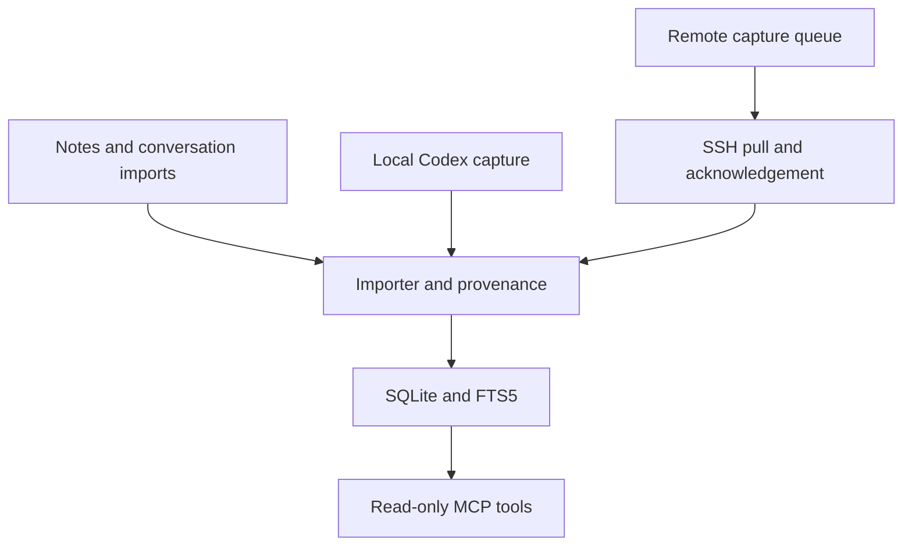

# ThreadSatchel

**Keep the thread. Carry the context.**

A small, local memory archive that AI assistants can search through MCP. Keep original conversations, notes, and source information in one SQLite database instead of repeatedly explaining the same project in new chats.

**Early release.** Built and exercised on Windows, with a Linux capture node. It is a personal tool made shareable, not a hosted service or a promise to capture every chat automatically.

## Optional Qwen helper

Want local AI assistance with finding and reviewing your archive? The separate **[optional Qwen branch](https://github.com/stevej52/threadsatchel/tree/feature/optional-qwen-memory)** adds semantic search, source-linked interpretations, project briefs, and bounded CPU/RAM caching and background work. **Main stays model-free, and Qwen is off by default even on the optional branch.**

Start with the **[complete Qwen installation guide](https://github.com/stevej52/threadsatchel/blob/feature/optional-qwen-memory/docs/QWEN_INSTALL.md)** for requirements, pinned model/runtime downloads, checksums, startup commands, verification, and the on/off switch. The reference setup uses llama.cpp with Qwen2.5-14B chat inference plus a separate small Qwen3 CPU embedding model; optional NumPy accelerates vector ranking. Qwen's weights were not modified. GPU/RAM needs, tested hardware, privacy, and current limitations are documented there.

## What it does

- Exposes `search_memory` and `get_memory` through a read-only MCP server.
- Imports text, Markdown, structured conversation excerpts, and a supported ChatGPT export ZIP shape.
- Stores full original text, provenance, source IDs, and revisions; searches with SQLite FTS5.
- Captures supported local Codex text events incrementally, without model/API calls.
- Can queue capture on several machines and pull it into one archive over existing SSH connections.
- Makes repeated imports safe and conservatively reconciles overlapping excerpts.
- Optionally imports completed inbox files every two minutes using the same importer.

## Start here

> **ChatGPT users: required setup step**
>
> ThreadSatchel does **not** automatically save ordinary ChatGPT conversations merely because the MCP server is connected. After connecting ThreadSatchel, copy the [recommended standing instructions](docs/STANDING_INSTRUCTIONS.md) into ChatGPT's Custom Instructions (or equivalent standing-instructions field) and replace the path placeholders for your installation. **If you skip this step, ChatGPT can search existing ThreadSatchel memory, but new ordinary ChatGPT turns will not be reliably delivered to the archive.**
>
> Codex is different: supported local Codex capture can run outside the model. See [capture and multi-machine setup](docs/CAPTURE.md).

Requires Python 3.12+ with SQLite FTS5. The tested MCP dependency is pinned in requirements.txt.

```sh
python -m venv .venv
# Activate .venv using your shell, then:
python -m pip install -r requirements.txt
python setup_memory.py
python import_memory.py examples/example-excerpt.json
```

Connect your MCP client to the absolute path of `.venv`'s Python executable, with the absolute path of `server_readonly.py` as its argument. Ask it to search for **sample archive** to check the example import. See [connection instructions](docs/CONNECTING.md), including Codex configuration.

For optional automatic local capture:

```sh
python codex_capture_export.py --config capture-local.json --dry-run
python codex_capture_export.py --config capture-local.json
python install_schedule.py local
```

The installer is opt-in. Windows uses a limited task while your account is logged in; Linux uses a systemd user timer. See [capture and multi-machine setup](docs/CAPTURE.md).

For optional automatic inbox imports:

```sh
python inbox_sweep.py
python install_schedule.py inbox
```

Write a temporary `.incoming-<id>.json.part` file inside `inbox/`, then rename it to a new final `.json` filename after the write is complete. The sweep imports completed JSON, TXT, and Markdown files, retains originals and failures, skips existing import receipts, and records its results locally. See [inbox delivery and scheduling](docs/INBOX_SWEEP.md).

## How it fits together



## Read before importing your history

[Imports and duplicates](docs/IMPORTING.md) explains exact IDs, revisions, ambiguous matches, and the ZIP limitation. A real user's complete OpenAI export has **not yet been validated**; current export tests use synthetic fixtures.

[Privacy and security](docs/PRIVACY.md) explains retained raw bytes, plaintext storage, capture omissions, and the difference between a read-only endpoint and the optional writable endpoint. Retrieved memories are source material, not instructions to execute.

This does **not** automatically capture ChatGPT's website or phone app, every Claude conversation, other users' chats, hidden reasoning, or all historic Codex formats. MCP connects an assistant to tools; it does not grant access to its entire chat history.

## Development

Run `python scripts/check.py` for isolated tests. See [architecture](docs/ARCHITECTURE.md) for the modules and data flow. No embeddings, vector database, paid API key, or model inference are required by this software. Your AI client's normal usage still applies when it retrieves and reads memories.

MIT licensed. Independent project; not affiliated with OpenAI or Anthropic.
