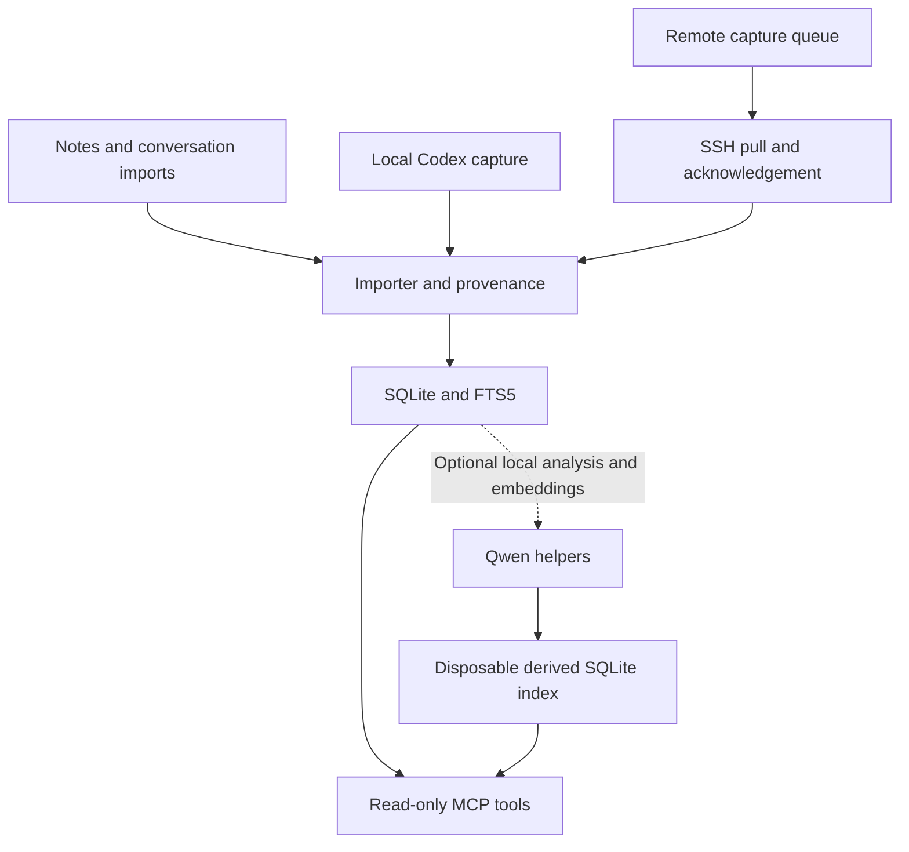

# ThreadSatchel

**Keep the thread. Carry the context.**

A small, local memory archive that AI assistants can search through MCP. Keep original conversations, notes, and source information in one SQLite database instead of repeatedly explaining the same project in new chats.

**Early release.** Built and exercised on Windows, with a Linux capture node. It is a personal tool made shareable, not a hosted service or a promise to capture every chat automatically.

## Create your own plugin and use it with Dot

**ThreadSatchel has been tested with Dot and appears to work well** through the author's private gateway, including the updated search and archive-pagination tools. This is an early compatibility report from that setup.

**[Create your own ThreadSatchel plugin](docs/CREATE_YOUR_OWN_PLUGIN.md)** provides detailed setup steps, copyable build prompts, the private gateway/connector specification, local desktop and Secure MCP Tunnel alternatives, Dot instructions, verification, and maintenance. Each person creates and operates their own plugin with their own archive, account, credentials, and hosting. No shared plugin, author-hosted service, or author involvement is required.

Use the current source on `main` or this optional Qwen branch for these changes; the original `v0.1.0` download predates them. Ordinary search defaults to 20 results and allows up to 100. The new read-only `list_memories` tool pages through original records with stable IDs, counts, and a continuation cursor, so an assistant can verify a complete inventory without loading the whole archive at once.

**Imports are working with both OpenAI and Claude.** A full real OpenAI conversation export (memory dump) was successfully imported, and repeating it added zero new records. Claude conversation material is also being successfully imported through ThreadSatchel's structured packet workflow. See [import formats and verified results](docs/IMPORTING.md) for the exact scope and instructions.

## Optional Qwen helper: start here

This is the **`feature/optional-qwen-memory` branch**. The [main branch](https://github.com/stevej52/threadsatchel/tree/main) remains the simpler, model-free version. Qwen is **off by default even on this branch**; importing and searching your original archive still work without it.

**[Follow the Qwen installation guide](docs/QWEN_INSTALL.md)** for the exact branch, Python dependencies, pinned model/runtime downloads and checksums, startup commands, configuration, verification, scheduling, and troubleshooting. The reference setup uses Windows, llama.cpp, a GPU for Qwen2.5-14B chat inference, and four CPU threads for a separate Qwen3 embedding model. It needs no paid API or cloud inference service.

| Component | What it contributes | Required for the base archive? |
| --- | --- | --- |
| SQLite FTS5 and the importer | Exact-word search, preserved originals, provenance, repeat-safe imports | Yes; included in the core setup |
| Qwen2.5-14B-Instruct, Q4_K_M | Suggested summaries, evidence-linked facts, project briefs, and selective result reranking | No |
| **Qwen3-Embedding-0.6B, Q8_0** | CPU-generated vectors for finding related wording, stored in a disposable local SQLite index | No |
| NumPy (`requirements-ai.txt`) | Faster CPU ranking of cached numeric vectors | No; optional acceleration |

**We did not retrain or modify Qwen's model weights.** We added ThreadSatchel code around the models: bounded processing, strict structured-output and source-quotation checks, hybrid retrieval, caches, diagnostics, and controlled retries. The separate embedding model is the additional model to install. There is no separate reranker model, PyTorch requirement, or external vector database.

Four further opt-in features use spare CPU/RAM: extra CPU embedding passes, warm retrieval caches, prepared project context, and periodic sampled health checks. They reuse the existing worker/MCP processes. Their resource guards currently support Windows; see [limits and switches](docs/OPTIONAL_QWEN.md#optional-idle-cpu-and-ram-use).

Exact IDs and strong short literal searches keep a fast lexical path. Semantic questions and live reranking can take longer; repeated queries and precomputed briefs benefit from caching. Qwen improves the ways you can find and review evidence, but does not guarantee that every search is faster or every interpretation is correct. Missing or unavailable models leave original-record retrieval and ordinary lexical search available.

## What it does

- Exposes `search_memory`, `list_memories`, and `get_memory` through a read-only MCP server.
- Imports text, Markdown, structured conversation excerpts, and a supported ChatGPT export ZIP shape.
- Stores full original text, provenance, source IDs, and revisions; searches with SQLite FTS5.
- Captures supported local Codex text events incrementally, without model/API calls.
- Can queue capture on several machines and pull it into one archive over existing SSH connections.
- Makes repeated imports safe and conservatively reconciles overlapping excerpts.
- Optionally imports completed inbox files every two minutes using the same importer.
- Returns compact search excerpts, with full originals available by ID or `full=True` on the same ranked search results.
- Optionally adds local Qwen semantic search, evidence-linked interpretations and cached project briefings. This feature is off unless you enable it; the normal installation needs no model or special hardware.

## Core installation (Qwen not required)

Requires Python 3.12+ with SQLite FTS5. The tested MCP dependency is pinned in requirements.txt.

Download or clone the branch you want, then run the following from that checkout. For a new Qwen installation, the [step-by-step guide](docs/QWEN_INSTALL.md) includes these core steps. Existing installations should back up their archive and local settings before updating; do not replace working configuration with example files.

```sh
python -m venv .venv
# Activate .venv using your shell, then:
python -m pip install -r requirements.txt
python setup_memory.py
python import_memory.py examples/example-excerpt.json
```

Connect your MCP client to the absolute path of `.venv`'s Python executable, with the absolute path of `server_readonly.py` as its argument. Ask it to search for **sample archive** to check the example import. See [connection instructions](docs/CONNECTING.md), including Codex configuration.

For optional automatic local capture:

```sh
python codex_capture_export.py --config capture-local.json --dry-run
python codex_capture_export.py --config capture-local.json
python install_schedule.py local
```

The installer is opt-in. Windows uses a limited task while your account is logged in; Linux uses a systemd user timer. See [capture and multi-machine setup](docs/CAPTURE.md).

For optional automatic inbox imports:

```sh
python inbox_sweep.py
python install_schedule.py inbox
```

Write a temporary `.incoming-<id>.json.part` file inside `inbox/`, then rename it to a new final `.json` filename after the write is complete. The sweep imports completed JSON, TXT, and Markdown files, retains originals and failures, skips existing import receipts, and records its results locally. See [inbox delivery and scheduling](docs/INBOX_SWEEP.md).

## How it fits together

This branch includes an [optional Qwen layer](docs/OPTIONAL_QWEN.md), with explicit on/off commands. Its disposable derived index never replaces the original archive or importer. Model weights and optional acceleration dependencies are installed separately; existing capture and inbox delivery continue to work with AI off.



The read-only MCP endpoint exposes `search_memory`, `list_memories`, `get_memory`, `get_project_brief`, and `memory_ai_status`. Full text and provenance remain available through `get_memory`; AI-derived results link back to those originals. The model never becomes the authoritative archive.

For the optional layer, after installation and service startup:

```sh
python memory_ai.py status
python memory_ai.py on
python memory_ai.py process
python memory_ai.py brief general
python memory_ai.py off
```

These are individual controls, not a startup script: the embedding owner must already be running before processing or semantic search. Follow the [startup order](docs/QWEN_INSTALL.md#4-enable-and-test-in-the-right-order). The off switch preserves the archive and derived cache; an in-flight operation may finish.

## Save results and extra fields

Valid packets can include extra fields such as `provenance` or `notes`. The importer preserves them as inert metadata, keeps original file bytes and message text unchanged, and reports `import_status: "imported_with_warnings"` with `has_warnings: true`. Full retrieval includes generated import notes beside the preserved fields. Invalid required text, format, and identity fields still fail validation.

[Save results and troubleshooting](docs/SAVE_RESULTS.md) explains the result fields, safe error details, and retry procedure. Repeat the unchanged finalized packet; a custom gateway must also reuse the same request key. Extra metadata is not automatically merged by meaning. The repository's read-only stdio server provides retrieval; remote save operations and their durable error logs require your separately built personal connector.

## Read before importing your history

[Imports and duplicates](docs/IMPORTING.md) explains exact IDs, revisions, ambiguous matches, size limits, and the successfully tested OpenAI and Claude import paths. The OpenAI test included numbered conversation files and supplied voice transcripts. Attachments and unsupported content remain in preserved originals; an outer account-data ZIP needs its conversation ZIP selected explicitly. Claude imports use ThreadSatchel packets; there is no native arbitrary Claude account-export ZIP parser.

[Privacy and security](docs/PRIVACY.md) explains retained raw bytes, plaintext storage, capture omissions, and the difference between a read-only endpoint and the optional writable endpoint. Retrieved memories are source material, not instructions to execute.

This does **not** automatically capture ChatGPT's website or phone app, every Claude conversation, other users' chats, hidden reasoning, or all historic Codex formats. MCP connects an assistant to tools; it does not grant access to its entire chat history.

## Development

Run `python scripts/check.py` for isolated tests, including bounded inputs, retry/concurrency safety, and optional AI cache/retrieval regressions. The suite uses synthetic data and injected model responses; it does not require downloading Qwen or opening your archive. See [architecture](docs/ARCHITECTURE.md) for the modules and data flow. The **core installation** requires no embeddings, external vector database, paid API key, or model inference. Your AI client's normal usage still applies when it retrieves and reads memories.

For installation details use [Qwen setup](docs/QWEN_INSTALL.md); for evidence handling, cache invalidation, resource limits, and recovery use [optional AI behavior](docs/OPTIONAL_QWEN.md). The reference machine and tested/untested combinations are documented so you can judge whether the optional layer fits your hardware.

MIT licensed. Independent project; not affiliated with OpenAI or Anthropic.
