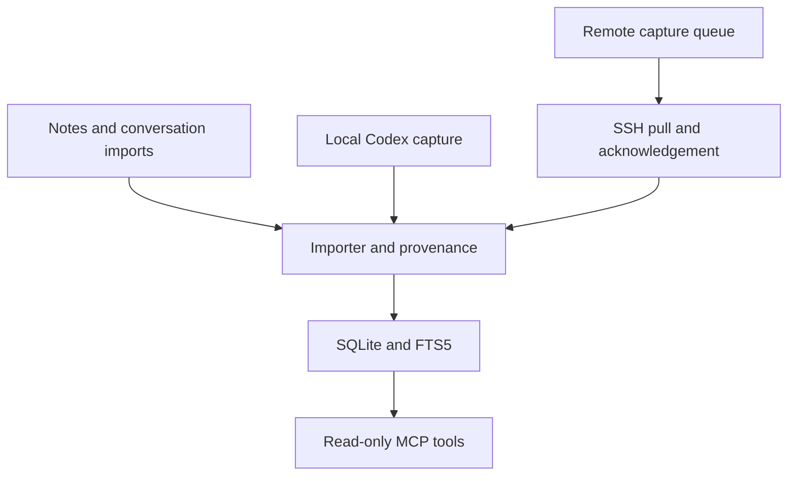

# ThreadSatchel

**Keep the thread. Carry the context.**

A small, local memory archive that AI assistants can search through MCP. Keep original conversations, notes, and source information in one SQLite database instead of repeatedly explaining the same project in new chats.

**Early release.** Built and exercised on Windows, with a Linux capture node. It is a personal tool made shareable, not a hosted service or a promise to capture every chat automatically.

## Create your own plugin and use it with Dot

**ThreadSatchel has been tested with Dot and appears to work well** through the author's private gateway, including the updated search and archive-pagination tools. This is an early compatibility report from that setup.

**[Create your own ThreadSatchel plugin](docs/CREATE_YOUR_OWN_PLUGIN.md)** provides detailed setup steps, copyable build prompts, the private gateway/connector specification, local desktop and Secure MCP Tunnel alternatives, Dot instructions, verification, and maintenance. Each person creates and operates their own plugin with their own archive, account, credentials, and hosting. No shared plugin, author-hosted service, or author involvement is required.

Use the current `main` source for these changes; the original `v0.1.0` download predates them. Ordinary search defaults to 20 results and allows up to 100. The new read-only `list_memories` tool pages through original records with stable IDs, counts, and a continuation cursor, so an assistant can verify a complete inventory without loading the whole archive at once.

**Imports are working with both OpenAI and Claude.** A full real OpenAI conversation export (memory dump) was successfully imported, and repeating it added zero new records. Claude conversation material is also being successfully imported through ThreadSatchel's structured packet workflow. See [import formats and verified results](docs/IMPORTING.md) for the exact scope and instructions.

## Optional Qwen helper

Want local AI assistance with finding and reviewing your archive? The separate **[optional Qwen branch](https://github.com/stevej52/threadsatchel/tree/feature/optional-qwen-memory)** adds semantic search, source-linked interpretations, project briefs, and bounded CPU/RAM caching and background work. **Main stays model-free, and Qwen is off by default even on the optional branch.**

Start with the **[complete Qwen installation guide](https://github.com/stevej52/threadsatchel/blob/feature/optional-qwen-memory/docs/QWEN_INSTALL.md)** for requirements, pinned model/runtime downloads, checksums, startup commands, verification, and the on/off switch. The reference setup uses llama.cpp with Qwen2.5-14B chat inference plus a separate small Qwen3 CPU embedding model; optional NumPy accelerates vector ranking. Qwen's weights were not modified. GPU/RAM needs, tested hardware, privacy, and current limitations are documented there.

## What it does

- Exposes `search_memory`, `list_memories`, and `get_memory` through a read-only MCP server.
- Imports text, Markdown, structured conversation excerpts (including Claude material), and supported OpenAI conversation export ZIPs, including numbered JSON parts.
- Stores full original text, provenance, source IDs, and revisions; searches with SQLite FTS5.
- Captures supported local Codex text events incrementally, without model/API calls.
- Can queue capture on several machines and pull it into one archive over existing SSH connections, with five-minute sync, hidden Windows SSH windows, and longer waits after failed syncs.
- Makes repeated imports safe and conservatively reconciles overlapping excerpts.
- Optionally imports completed inbox files every two minutes using the same importer.

## Start here

> **ChatGPT users: required setup step**
>
> ThreadSatchel does **not** automatically save ordinary ChatGPT conversations merely because the MCP server is connected. After connecting ThreadSatchel, copy the [recommended standing instructions](docs/STANDING_INSTRUCTIONS.md) into ChatGPT's Custom Instructions (or equivalent standing-instructions field) and replace the path placeholders for your installation. **If you skip this step, ChatGPT can search existing ThreadSatchel memory, but new ordinary ChatGPT turns will not be reliably delivered to the archive.**
>
> Codex is different: supported local Codex capture can run outside the model. See [capture and multi-machine setup](docs/CAPTURE.md).

Requires Python 3.12+ with SQLite FTS5. The tested MCP dependency is pinned in requirements.txt.

```sh
python -m venv .venv
# Activate .venv using your shell, then:
python -m pip install -r requirements.txt
python setup_memory.py
python import_memory.py examples/example-excerpt.json
```

Connect your MCP client to the absolute path of `.venv`'s Python executable, with the absolute path of `server_readonly.py` as its argument. Ask it to search for **sample archive** to check the example import. See [connection instructions](docs/CONNECTING.md), including Codex configuration.

For optional automatic local capture:

```sh
python codex_capture_export.py --config capture-local.json --dry-run
python codex_capture_export.py --config capture-local.json
python install_schedule.py local
```

The installer is opt-in. Windows uses a limited task while your account is logged in; Linux uses a systemd user timer. See [capture and multi-machine setup](docs/CAPTURE.md).

For optional automatic inbox imports:

```sh
python inbox_sweep.py
python install_schedule.py inbox
```

Write a temporary `.incoming-<id>.json.part` file inside `inbox/`, then rename it to a new final `.json` filename after the write is complete. The sweep imports completed JSON, TXT, and Markdown files, retains originals and failures, skips existing import receipts, and records its results locally. See [inbox delivery and scheduling](docs/INBOX_SWEEP.md).

## How it fits together



## Save results and extra fields

Valid packets can include extra fields such as `provenance` or `notes`. The importer preserves them as inert metadata, keeps original file bytes and message text unchanged, and reports `import_status: "imported_with_warnings"` with `has_warnings: true`. Full retrieval includes generated import notes beside the preserved fields. Invalid required text, format, and identity fields still fail validation.

[Save results and troubleshooting](docs/SAVE_RESULTS.md) explains the result fields, safe error details, and retry procedure. Repeat the unchanged finalized packet; a custom gateway must also reuse the same request key. Extra metadata is not automatically merged by meaning. The repository's read-only stdio server provides retrieval; remote save operations and their durable error logs require your separately built personal connector.

## Read before importing your history

[Imports and duplicates](docs/IMPORTING.md) explains exact IDs, revisions, ambiguous matches, size limits, and the successfully tested OpenAI and Claude import paths. The OpenAI test included numbered conversation files and supplied voice transcripts. Attachments and unsupported content remain in preserved originals; an outer account-data ZIP needs its conversation ZIP selected explicitly. Claude imports use ThreadSatchel packets; there is no native arbitrary Claude account-export ZIP parser.

[Privacy and security](docs/PRIVACY.md) explains retained raw bytes, plaintext storage, capture omissions, and the difference between a read-only endpoint and the optional writable endpoint. Retrieved memories are source material, not instructions to execute.

This does **not** automatically capture ChatGPT's website or phone app, every Claude conversation, other users' chats, hidden reasoning, or all historic Codex formats. MCP connects an assistant to tools; it does not grant access to its entire chat history.

## Development

Run `python scripts/check.py` for isolated tests. See [architecture](docs/ARCHITECTURE.md) for the modules and data flow. No embeddings, vector database, paid API key, or model inference are required by this software. Your AI client's normal usage still applies when it retrieves and reads memories.

MIT licensed. Independent project; not affiliated with OpenAI or Anthropic.
